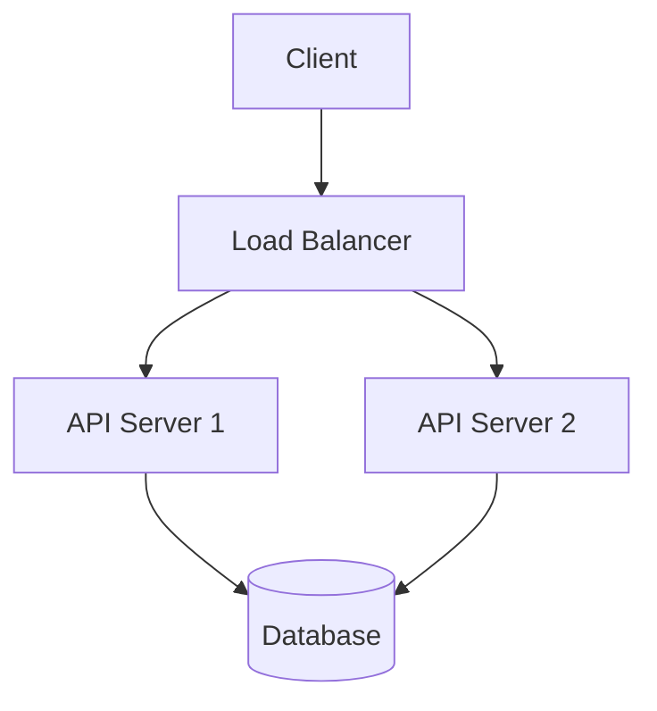

# DeepWiki Documentation System - Usage Guide

## Overview

Your Docusaurus site is now configured with a professional DeepWiki-style documentation system. This includes specialized prompts, organized structure, and examples for creating technical documentation.

## Quick Start

### 1. Using the Master Prompt

Copy the content from `docs/prompts/deepwiki-master-prompt.md` and use it with any LLM to convert your technical content:

**Example Usage:**
```
[Paste the master prompt]

Here are my notes on distributed consensus algorithms:
- Raft algorithm for leader election
- Log replication mechanisms
- Safety properties and proofs
```

### 2. Converting LaTeX Documents

Use `docs/prompts/tex-to-markdown-prompt.md` to convert academic papers or LaTeX notes:

**Example:**
```
[Paste the LaTeX conversion prompt]

Convert this LaTeX content:
\section{Distributed Systems}
\subsection{Consensus Algorithms}
$$P(consensus) = \frac{n-f}{n}$$
```

### 3. Generating Architecture Diagrams

Use `docs/prompts/architecture-diagram-prompt.md` for creating Mermaid diagrams:

**Example:**
```
[Paste the architecture diagram prompt]

Create a diagram showing:
- Client requests to API Gateway
- API Gateway routing to microservices
- Services accessing shared database
```

## Documentation Structure

```
docs/
├── intro.md                    # Homepage
├── systems/                    # System architecture docs
│   └── overview.md
├── algorithms/                 # Algorithm documentation
│   └── overview.md
└── prompts/                    # Documentation generation prompts
    ├── deepwiki-master-prompt.md
    ├── tex-to-markdown-prompt.md
    ├── sidebar-generation-prompt.md
    └── architecture-diagram-prompt.md
```

## Adding New Documentation

### 1. Create New Categories

Add new folders under `docs/` for different technical areas:
```
docs/
├── databases/
├── networking/
├── security/
└── performance/
```

### 2. Update Sidebar

Modify `sidebars.ts` to include new categories:
```typescript
{
  type: 'category',
  label: 'Database Systems',
  items: ['databases/overview', 'databases/replication'],
}
```

### 3. Follow DeepWiki Style

Each document should include:
- **Purpose and Scope** - What the system does
- **System Overview** - High-level architecture
- **Core Abstractions** - Key concepts and interfaces
- **Data Flow** - How information moves through the system
- **Design Trade-offs** - Engineering decisions and rationale
- **Failure Handling** - Error scenarios and recovery

## Mathematical Content

Use LaTeX syntax for mathematical expressions:

**Inline math:** `$O(n \log n)$`

**Block math:**
```
$$
\text{Throughput} = \frac{\text{Requests}}{\text{Time}} \times \text{Parallelism Factor}
$$
```

## Code Examples

Include code with proper language tags:

```python
def consistent_hash(key: str, nodes: List[str]) -> str:
    """Map key to node using consistent hashing."""
    hash_value = hash(key) % (2**32)
    return min(nodes, key=lambda n: hash(n) % (2**32) - hash_value)
```

## Mermaid Diagrams

Add architecture diagrams using Mermaid:



## Development Commands

```bash
# Start development server
npm start

# Build for production
npm run build

# Serve built site
npm run serve
```

## Best Practices

1. **Technical Depth** - Focus on system design, not tutorials
2. **Professional Tone** - Write as official documentation
3. **Clear Structure** - Use consistent section headings
4. **Visual Aids** - Include diagrams for complex systems
5. **Mathematical Rigor** - Use proper notation for algorithms
6. **Code Quality** - Provide clean, commented examples

## Portfolio Impact

This documentation style demonstrates:
- **System Design Skills** - Deep technical understanding
- **Communication Ability** - Clear technical writing
- **Professional Standards** - Industry-grade documentation
- **Technical Breadth** - Coverage of distributed systems concepts

Your documentation is now ready for professional use and will make a strong impression on technical recruiters and hiring managers.