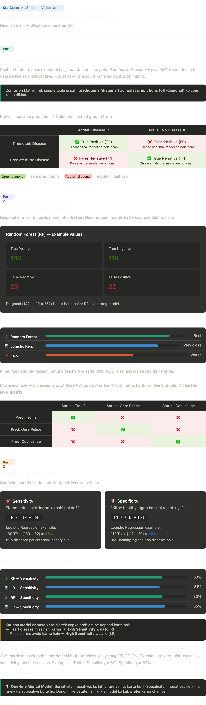

# Confusion Matrix, Sensitivity & Specificity – Notes

These notes are on **confusion matrices** and **sensitivity/specificity** (heart disease + movie examples).

## 1. Confusion Matrix – Intuition

We have a classifier that predicts:  
“Does this patient have heart disease: **Yes / No**?”

We want to know, on **test data**:

- What did it predict **correctly**?
- What did it predict **incorrectly**?

A **confusion matrix** is a table that counts:

- Correct predictions (diagonal)
- Mistakes (off‑diagonal)

We use this to **compare models** (e.g. Random Forest vs KNN vs Logistic Regression).

Before building the confusion matrix:

- Split data into **training** and **testing** sets (or use cross‑validation).
- Train each model on training data.
- Evaluate each trained model on the **same** test data to fill its confusion matrix.

---

## 2. Confusion Matrix Structure (Binary Classification)

Two classes:

- Positive class: “Heart disease”
- Negative class: “No heart disease”

We define:

- **Rows** = model’s prediction  
- **Columns** = actual / ground truth

### 2×2 Confusion Matrix

|                     | Actual: Disease (Positive) | Actual: No Disease (Negative) |
|---------------------|---------------------------|-------------------------------|
| Pred: Disease       | **TP** – True Positive    | **FP** – False Positive       |
| Pred: No Disease    | **FN** – False Negative   | **TN** – True Negative        |

- **True Positive (TP)**:  
  Disease **was present**, model predicted **disease**.

- **True Negative (TN)**:  
  Disease **was absent**, model predicted **no disease**.

- **False Negative (FN)**:  
  Disease **was present**, model predicted **no disease**  
  → dangerous miss: sick person labeled as healthy.

- **False Positive (FP)**:  
  Disease **was absent**, model predicted **disease**  
  → false alarm: healthy person labeled as sick.

**Diagonal = TP + TN = correct predictions**  
**Off-diagonal = FP + FN = model’s mistakes**

---

## 3. Using Confusion Matrices to Compare Models

Example (rough numbers from video):

- **Random Forest** confusion matrix:

  - TP = 142  
  - TN = 110  
  - FN = 29  
  - FP = 22  

  Diagonal = 142 + 110 = 252 → lot of correct predictions ⇒ strong performance.

- **KNN** confusion matrix:

  - Fewer TP and TN than RF  
  - More FN and/or FP  

  ⇒ Overall worse than Random Forest on this dataset.

- **Logistic Regression** confusion matrix:

  - Very close to Random Forest (similar TP/TN, FP/FN)  
  - Just looking at confusion matrices, RF vs Logistic is not an obvious winner.

Conclusion:

- **KNN < RF** for this dataset (clearly worse confusion matrix).
- **RF vs Logistic Regression**: Confusion matrix alone is not enough to decide; we need more metrics (sensitivity, specificity, ROC, AUC, etc.).

---

## 4. Multi‑class Confusion Matrix

Movie example:

- 3 classes:  
  - Troll 2  
  - Gore Police  
  - Cool as Ice  

This gives a **3×3 confusion matrix**:

|                     | Actual Troll 2 | Actual Gore Police | Actual Cool as Ice |
|---------------------|----------------|--------------------|--------------------|
| Pred Troll 2        | TP for Troll 2 | FP w.r.t Troll 2   | FP w.r.t Troll 2   |
| Pred Gore Police    | FP             | TP for Gore Police | FP                 |
| Pred Cool as Ice    | FP             | FP                 | TP for Cool as Ice |

General rule:

- For **N classes**, confusion matrix is **N × N**.
- Diagonal = correct predictions (right class).
- Off‑diagonal = where the model got confused and chose the wrong class.

---

## 5. One‑Line Mental Model (Confusion Matrix)

“A confusion matrix is a table that counts, for each class, how many times the model was **correct** (diagonal) and how many times it got **confused** (off‑diagonal), and we use it to fairly compare classification models.”

---

## 6. Sensitivity & Specificity – Overview

Sensitivity and specificity are two metrics **derived from the confusion matrix** (binary case) that tell us:

- How well the model catches **positives** (sick people).
- How well the model avoids false alarms on **negatives** (healthy people).

We still use the same TP, TN, FP, FN from the confusion matrix.

---

## 7. Sensitivity (aka Recall / True Positive Rate)

**Question:**  
“Of all the actual positives, how many did we correctly catch?”

Formula:

$$
\text{Sensitivity} = \frac{\text{TP}}{\text{TP} + \text{FN}}
$$

- Denominator = all **actual positives** (disease present).  
- Numerator = those positives that the model correctly labeled as positive.

Example (Logistic Regression):

- TP = 139  
- FN = 32  
- Sensitivity ≈ 139 / (139 + 32) ≈ 0.81 (81%)

Interpretation:

- The model correctly identifies about **81% of diseased patients**.
- Remaining 19% (FN) are sick but classified as healthy.

---

## 8. Specificity (True Negative Rate)

**Question:**  
“Of all the actual negatives, how many did we correctly reject as negative?”

Formula:

$$
\text{Specificity} = \frac{\text{TN}}{\text{TN} + \text{FP}}
$$

- Denominator = all **actual negatives** (no disease).  
- Numerator = those negatives that the model correctly labeled as negative.

Example (Logistic Regression):

- TN = 112  
- FP = 20  
- Specificity ≈ 112 / (112 + 20) ≈ 0.85 (85%)

Interpretation:

- The model correctly calls **85% of healthy people** “no disease”.
- Remaining 15% (FP) are healthy but classified as diseased (false alarms).

---

## 9. Comparing Models with Sensitivity & Specificity

Suppose:

- **Random Forest (RF)**:
  - Sensitivity ≈ 0.83  
  - Specificity ≈ 0.83  

- **Logistic Regression (LR)**:
  - Sensitivity ≈ 0.81  
  - Specificity ≈ 0.85  

Interpretation:

- RF has **higher sensitivity** → better at catching positives (fewer missed sick people).
- LR has **higher specificity** → better at not raising false alarms on healthy people.

Which one is “better” depends on the **problem**:

- For **heart disease detection** (missing a sick patient is very bad):
  - Prefer **higher sensitivity** (e.g., Random Forest).
- For a scenario where false alarms are very costly or annoying:
  - Prefer **higher specificity** (e.g., Logistic Regression).

---

## 10. Multi‑class Case for Sensitivity/Specificity

With 3+ classes (e.g. three movie categories):

- There is no single global sensitivity/specificity for the whole matrix.
- For each class (e.g., Troll 2), you define:

  - TP = correctly predicted as that class.  
  - FN = actually that class but predicted as something else.  
  - FP = predicted as that class but actually another class.  
  - TN = all other cells (neither actual nor predicted as that class).

- Then compute **class‑specific** sensitivity and specificity:

$$
\text{Sensitivity}_\text{class} = \frac{\text{TP}_\text{class}}{\text{TP}_\text{class} + \text{FN}_\text{class}}
$$

$$
\text{Specificity}_\text{class} = \frac{\text{TN}_\text{class}}{\text{TN}_\text{class} + \text{FP}_\text{class}}
$$

Each class gets its own sensitivity and specificity.

---

## 11. One‑Line Mental Model (Sensitivity & Specificity)

- **Sensitivity**:  
  “Of all the actual positives, how many do we **rarely miss**?”  
  $(= \text{TP} / (\text{TP} + \text{FN}))$

- **Specificity**:  
  “Of all the actual negatives, how many do we **rarely call positive by mistake**?”  
  $(= \text{TN} / (\text{TN} + \text{FP}))$

Together they tell us:

“How good is this model at catching the cases we care about (positives) and avoiding unnecessary false alarms (negatives), and which model fits our problem’s priorities better?”

