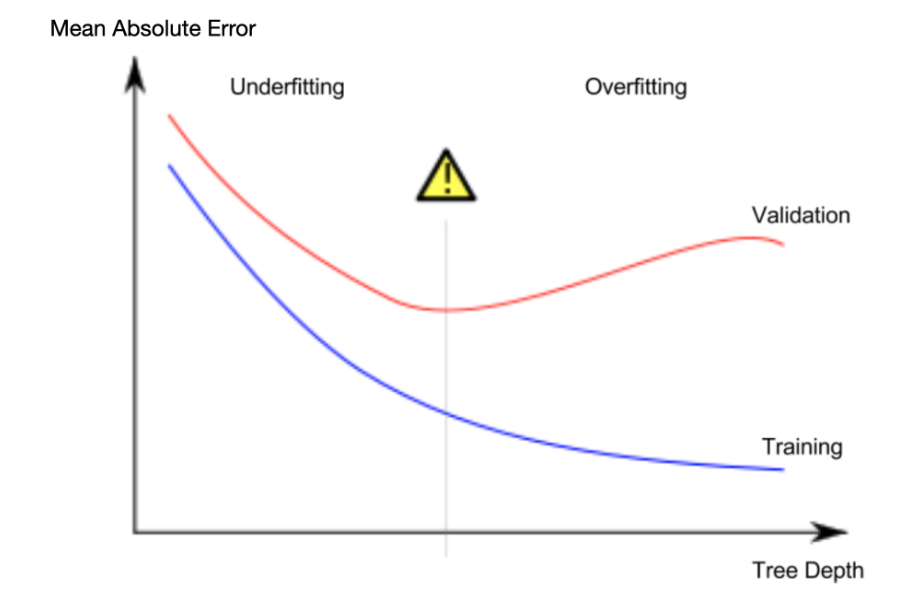

# Machine Learning - easy

## TLDR;

- We define the problem or task or a hypothesis about the data. 
    - Say, Predicting house price based on features like location, size, and age.
- We collect the data.
- We preprocess/clean the data.
    -   drop missing values
    -   normalize numerical features
    -   encode categorical variables
- We engineer features from the data.
    -   create interaction terms
    -   extract features from text or images
- We select a model.
    -   linear model
    -   tree-based model
    -   neural network
- We train the model.
    -   use gradient descent or other optimization algorithms
    -   set learning rate, batch size, and number of epochs
    -   monitor training loss and validation metrics
- We evaluate the model.
    -   use testing data to assess performance
    -   compare metrics like accuracy, precision, recall, F1-score, and AUC-ROC
- We tune the model.
    -   use grid search or random search to find optimal hyperparameters
- We deploy the model.
- We monitor the model.

## ML Steps:

1. **Data Collection**: Gather relevant data for your project. This could include structured data (e.g., databases, spreadsheets) or unstructured data (e.g., text, images, videos).

2. **Data Preprocessing**: Clean and prepare the data for analysis. This might involve handling missing values, normalizing numerical features, encoding categorical variables, and splitting the data into training and testing sets.

3. **Feature Engineering**: Create new features from the raw data that might improve model performance. This could involve techniques like dimensionality reduction, feature scaling, or creating interaction terms.

4. **Model Selection**: Choose an appropriate machine learning model for your problem. This could be a linear model, a tree-based model, a neural network, or any other algorithm depending on the nature of your data and the problem you're trying to solve.

5. **Model Training**: Train the selected model using the training data. This involves feeding the data into the model and adjusting its internal parameters to minimize the difference between predicted and actual outcomes.

6. **Model Evaluation**: Assess the performance of the trained model using the testing data. Common metrics for evaluation include accuracy, precision, recall, F1-score, and area under the ROC curve (AUC-ROC).

7. **Hyperparameter Tuning**: Fine-tune the model's hyperparameters to optimize its performance. This might involve grid search, random search, or more advanced techniques like Bayesian optimization.

8. **Model Deployment**: Once you're satisfied with the model's performance, deploy it in a production environment where it can make predictions on new, unseen data. This could involve integrating the model into a web application, a mobile app, or a microservice.

9. **Monitoring and Maintenance**: Continuously monitor the deployed model's performance in a production environment. Collect feedback, detect drift, and retrain the model as needed to maintain its accuracy and relevance.

## Overfitting vs UnderFitting:

Overfitting:
- The model learns the training data too well, including the noise and outliers.
- It performs poorly on new, unseen data.
- Indicators: High training accuracy but low testing accuracy.

Underfitting:
- The model is too simple to capture the underlying patterns in the data.
- It fails to learn the relationships between features and the target variable.
- Indicators: Low training and testing accuracy.

