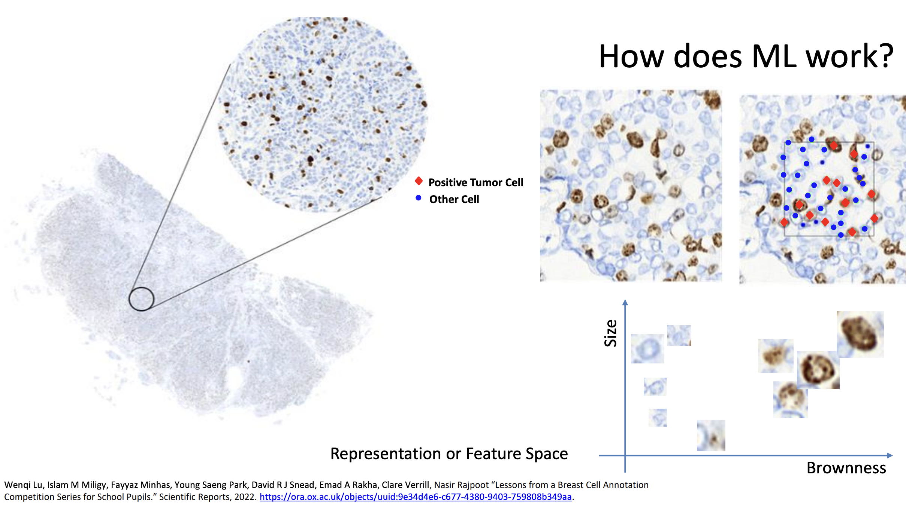

# Lecture 2: ML Algo

## Philosophy of ML ( 5 priciples)

-  Entities (anything the universrse) have explict  or implict representations.
- Semantic representations: The description is directly available in some medium. (text, image, audio, video, etc.). Semantic relatedness of the entities is context dependent andd this their representation are contextual.
- Representation of an entitty can allow us to reconstruct or generate it. Structural representations: The description is not directly available in some medium. (pixels, audio waveforms, vectors of features, graphs, etc.) 
- It is possible to delevop representation in an inductive manner (i.e, through empirical observation of the data).
- To act effectively and adaptively towards a goal, a being requires
developing and using causal representations of entities at an appropriate level of complexity.

## first principle of ML

Entities in the universe “having explicit or implicit representations” means that anything that exists can be described in some form that preserves information about it, even if that description is not written down or numerically encoded yet. 

## What “entity” and “representation” mean

- An **entity** can be anything: a physical object (apple, car), an abstract concept (justice, bank), an event (flight), or a person.   
- A **representation** is a way of encoding that entity so it can be stored, processed, or reasoned about (pixels in an image, audio waveforms, vectors of features, text, graphs, etc.). 

## Explicit vs implicit representations

- Explicit representation: The description is directly available in some medium.  
  - Examples: pixels of an image of a transformer toy, text “a yellow car that can transform into a transformer”, a feature vector \((x_1, x_2)\) for size and brownness of a cell.   
- Implicit representation: The entity is “encoded” in the state of some system, but not yet extracted in a neat form.  
  - Examples:  
    - A 3D scene encoded implicitly in the raw sensor readings of a camera before any feature extraction.   
    - Human memory of “my self” (your own body, experiences, and brain state) representing you, even if you have not written anything down.   

In ML, the goal is to turn many implicit or low‑level explicit representations (raw data) into useful explicit representations (features) that preserve the right information for tasks like classification, prediction, or generation.

[1](https://warwick.ac.uk/fac/sci/dcs/teaching/material/cs909/minhas-ml-1-introduction.pdf)

Application: 

How ML works?
We label the data and pass it to the ML model for training.

Goal of ML is to learn a function that maps the input to the output. (find a rule which creates differences between non-tumor rule to a tumor rule.)

Classification Approachs: Neareast Neighbor and kNN

### kNN:
- kNN is a simple yet powerful classification algorithm.
- It classifies a data point based on the majority class of its k nearest neighbors.
- kNN is a lazy learning algorithm, meaning it does not learn a discriminative function from the training data.
- It is a non-parametric algorithm, meaning it does not make any assumptions about the underlying data distribution.

#### Take k as the classifier. 
Minimum value of hyper-parameter k should be 3. Why because it is good enough to classify the data in case of outlier.

Think of k in k‑NN as “how many friends do we ask before deciding?”   
The smallest meaningful number of friends is 1, and the largest is “ask everyone in the class.” Those map to \(k = 1\) and \(k = N\) (number of training points). 

## 1. What are we trying to control with k?

- Without thinking about k, k‑NN could either:  
  - React too strongly to tiny local noise (if we listen to too few neighbours).  
  - Or ignore local patterns completely (if we listen to too many).  
- So k controls **how local** or **global** our decision is: small k → very local; large k → very global. 

## 2. What is the minimum k and why?

- Minimum sensible value: **\(k = 1\)** (1‑nearest neighbour).  
- Why not 0? With 0 neighbours, we literally have no information to vote with, so the rule is undefined.  
- With \(k = 1\):  
  - Each new point copies the label of its single closest training point.   
  - This can fit very detailed, wiggly boundaries around the data, but is extremely sensitive to noise and outliers (one mislabeled or weird point can flip decisions locally).

So the **root cause** of problems at very small k is: “we trust one neighbour too much, so tiny random variations can completely change the decision.”

## 3. What is the maximum k and why?

- Maximum meaningful value: **\(k = N\)**, where N is the number of training samples.  
- Why not bigger than N? There are only N training points; you cannot have more than N distinct nearest neighbours.  
- With \(k = N\):  
  - Every query point uses **all** training points for the vote.   
  - The prediction becomes the **global majority class** for every input, so the classifier is constant and ignores the input features.

So the **root cause** of problems at very large k is: “we average over everyone so much that we stop caring about where the point actually is in space.”

## 4. Where does a good k usually live?

- Good k is usually **between** these extremes: \(1 < k \ll N\).  
- Small k (like 3, 5, 7):  
  - Keeps decisions local but reduces the impact of a single noisy point.  
- Very large k (close to N):  
  - Makes the model overly smooth and biased, often predicting the same label for large regions or even everywhere.

So the natural story is:

- Too small k → overreact to noise (high variance).  
- Too large k → ignore structure (high bias).  
- Pick k in the middle, by validation, so that we “listen to enough neighbours to be stable, but not so many that we wash out local patterns.”

[1](https://warwick.ac.uk/fac/sci/dcs/teaching/material/cs909/minhas-ml-1-introduction.pdf)

is kNN a linear or non-linear classiifier

k‑NN is generally a **non‑linear** classifier in the original input/feature space. 

## Why k‑NN is non‑linear

- The decision boundary of k‑NN is formed by the regions where different classes win the local majority among neighbors, which creates irregular, piecewise boundaries in feature space rather than a single straight line.   
- In contrast, a linear classifier (like the lines shown for tumor vs non‑tumor cells) uses one linear function \(f(x) = w_1 x_1 + w_2 x_2 + b = 0\) to separate classes, which k‑NN does not do.

For k‑NN, think of the classifier as “asking its neighbours” instead of using a fixed formula, which already hints it is **non‑linear** in the original feature space. 

## 1. What would a linear classifier look like?

- A linear classifier draws one straight line (or hyperplane) in feature space and says “everything on this side is class A, everything on that side is class B,” like the simple lines shown for tumor vs non‑tumor cells.   
- So the key idea: with a linear model, the whole decision rule is captured by one equation \(f(x) = w_1 x_1 + w_2 x_2 + b = 0\) that never changes depending on where you stand in the space. 

## 2. How does k‑NN actually make decisions?

- k‑NN does something very different: for each new point, it looks around locally at its k closest training points and “takes a vote” on the label.   
- That means the decision for a point depends on a local neighbourhood that can have any shape, not on one global straight line.

## 3. What does this do to the boundary?

- Because each region of space can have a different mix of neighbours, the class regions end up as many small, irregular patches that wrap around the data points.   
- The boundary between classes is therefore a wiggly, piecewise shape that bends around the data cloud, not a single straight line.

## 4. So what is k‑NN: linear or non‑linear?

- Putting this together: a model whose decision boundary can twist and adapt to local data configurations is a **non‑linear** classifier in that feature space.   
- That’s exactly what k‑NN does, so k‑NN is considered a non‑linear classifier (even though the distance formula itself can be a simple Euclidean one).

