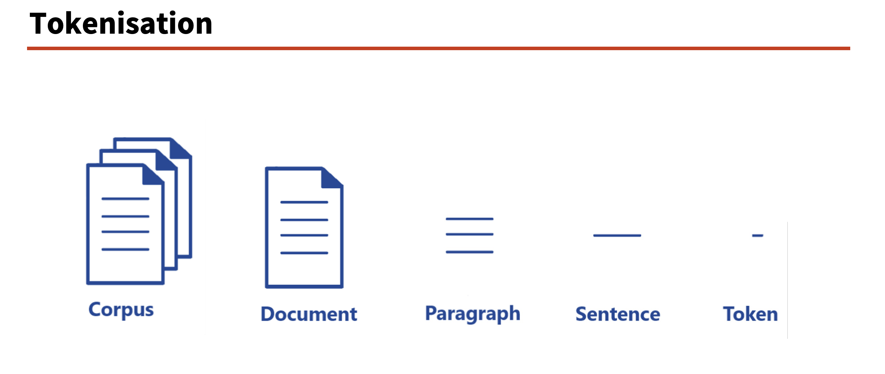
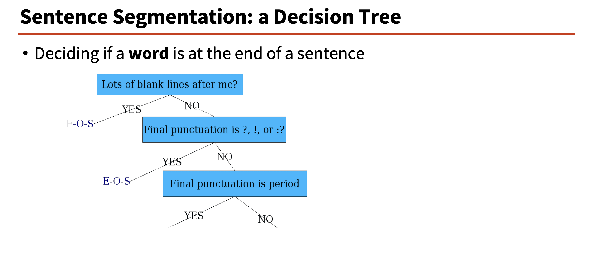

# NLP lec-2

## Text preprocessing

For sentiment analysis, maybe all we need to know is that both have the
word “happy”, irrespective of the variation.

- Tokenisation:
    Corpus: collection or dataset of text or speech. One or more documents.
    Document: a unit of text or speech.
    Token: a basic unit of text or speech.
    Tokenisation: the process of converting a document into a sequence of tokens.
    Word Tokenisation: the process of converting a document into a sequence of words.
    We can split each document/text into sentences, and these sentences into words.
    Sentence Tokenisation: the process of converting a document into a sequence of sentences.

### Sentence Segmentation:
`. !, ?` are relatively unambiguous

We can build a binary classifier:
Look at occurrences of ‘.’
`.` Classifies EndOfSentence (EOS) vs NotEndOfSentence

- Input: a sequence of tokens.
- Output: a binary label.
- Task: to predict whether the sequence of tokens is a sentence or not.

### Stopword removal

`Stopwords` are words that are very common in a language, and they do not carry much meaning.
words like “to”, “be”, “a”, “of” are not very meaningful.

Lemma: A lemma is the base form of a word. (basically can be found in the dictionary)
For example, the lemma of “running” is “run”.

How to remove stopwords?
- We can build a list of stopwords.
- We can remove stopwords from the tokenised text.

Difference between stopwords and lemmas:
- Stopwords are words that are very common in a language, and they do not carry much meaning.
- Lemmas are the base form of a word. (basically can be found in the dictionary)

Type vs Token:
Type: a unique element of the vocabulary.
Token: an instance of that type in the running text.

### Simple tokenization:
tr -sc ’A-Za-z’ ’\n’ < shakes.txt
Having shakes.txt as input (< shakes.txt)
Convert all non-alphabetic characters (-sc ‘A-Za-z’)
’A-Za-z’ means alphabetic
-c option complements to non-alphabet
-s option squeezes all sequences into a single character

### Word Segmentation

Maximum Matching Algorithm
Given a wordlist (dictionary) of Chinese, and a string as input:
1) Start a pointer at the beginning of the string
2) Find the longest word in dictionary that matches the string starting at pointer
3) Move the pointer over the word in string
4) Go to 2

It’s quite a bad algorithm for English!

## 1. Why text preprocessing?  
- Real text is inconsistent: same idea, many spellings or forms (UK / U.K. / uk / u.k.; happy / happier) .  
- For tasks like sentiment analysis, often only the core signal matters (e.g. presence of “happy”), not the exact surface variation .  

## 2. Tokenisation & sentence segmentation  
- A corpus is a collection of texts or speech; each document can be split into sentences, then sentences into word tokens .  
- Sentence boundaries are tricky: “!” and “?” are clear, but “.” can mean end of sentence, abbreviation (Inc., PhD.), or appear in numbers like 4.3 or .02% .  
- Ambiguity can be handled by a binary classifier over “.” (EOS vs not EOS), using rules, regex, or ML (e.g. decision tree with features: next word capitalised, previous word length, ellipsis, space after period) .  

## 3. Stopwords, tokens, types, corpora  
- Some very frequent words (“to”, “be”, “a”, “of”) carry little task-specific meaning and are called stopwords; they can be removed using lists such as those in NLTK .  
- Token = each occurrence in text; type = unique vocabulary item, so “The house on the hill is the best” has 8 tokens but 6 types, which drop if stopwords are removed .  
- For a corpus, \(N\) is the number of tokens and \(V\) the set of types, with \(|V|\) its size; examples include Shakespeare (~884k tokens, ~31k types) and Google N‑grams (1T tokens, 13M types) .  

## 4. Practical word tokenisation (Unix pipeline)  
- Example corpus: the complete works of Shakespeare (shakes.txt) .  
- A simple pipeline: `tr -sc 'A-Za-z' '\n' < shakes.txt` turns non-letters into newlines (tokenising); then `sort | uniq -c` counts word frequencies, and `sort -r -n` ranks by count .  
- Lowercasing with `tr 'A-Z' 'a-z'` before counting merges case variants (“The”, “the”) and changes the frequency distribution (e.g. “the” becomes even more frequent) .  

## 5. Tokenisation issues and language differences  
- English issues: possessives (“England’s”), contractions (“doesn’t”), hyphenated words (“state-of-the-art”), multi-word names (“Leamington Spa”), and variants like “U.K./UK” complicate token boundaries .  
- The Penn Treebank tokenizer uses regex rules to split text into tokens, e.g. “doesn’t” → “does n’t”, “£10” → “£ 10” in “The Leamington Spa-based restaurant … doesn’t charge £10” .  
- Other languages add more challenges: French clitics (l’ensemble), long German compounds (Lebensversicherungsgesellschaftsangestellter), and Chinese, where word segmentation is needed because words are built from characters rather than separated by spaces .  

## 6. Maximum matching for Chinese segmentation  
- Maximum matching algorithm: starting at the beginning of the string, repeatedly choose the longest dictionary word that matches, move the pointer, and continue .  
- In English this performs badly (“Thetabledownthere” → “Theta bled own there”), but in Chinese it works well on text like “莎拉波娃现在居住在美国东南部的佛罗里达。” .  

## 7. Normalisation & case folding  
- Normalisation makes different surface forms behave similarly; symmetric normalisation treats queries like “U.S.A.”, “USA”, and “US” as essentially the same .  
- Asymmetric normalisation is more selective: “Windows” might mean the OS, while “windows” might refer to generic windows, so the system must decide how broadly to expand results .  
- Case folding often lowercases everything because case is not always meaningful, but special cases (e.g. “US” vs “us”, mid-sentence proper nouns like “General Motors”) show that case can carry important information .  

## 8. Lemmatisation & stemming  
- Both lemmatisation and stemming reduce vocabulary size by collapsing word variants (e.g. “cars” and “car” → “car”) .  
- Lemmatisation maps words to dictionary headwords (am/are/is → be; car/cars/car’s/cars’ → car) and requires understanding meaning and part of speech (e.g. “Reading” city vs verb), making it accurate but computationally costly .  
- Stemming strips suffixes with rules or regex, producing shorter forms that may not be real words (“those cars are really beautiful” → “those car ar realli beauti”), but it is faster than a lemmatiser .  

## 9. Porter stemmer and lemma vs stem  
- The Porter stemmer uses rule sets: e.g. “sses” → “ss” (possesses → posess), “ies” → “i” (ponies → poni), and removes “ing/ed” when preceded by a vowel (walking → walk, plastered → plaster) .  
- Some results are counterintuitive: “having” → “hav”, “living” → “liv”, “something” → “someth”, while some “-ing” words are dropped entirely (king, sing, thing) or shortened (morning → morn) .  
- Comparing approaches: a stemmer gives non-dictionary stems (“for exampl compress and compress ar both accept as equival to compress”), while a lemmatiser produces grammatical dictionary forms (“for example compress and compress be both accept as equivalent to compress”) .  

## 10. Suggested reading  
- Main references: Jurafsky & Martin, “Speech and Language Processing”, 3rd ed., Chapter 2.2–2.5, and Bird, Klein & Loper, “Natural Language Processing with Python”, Chapters 1–3 .